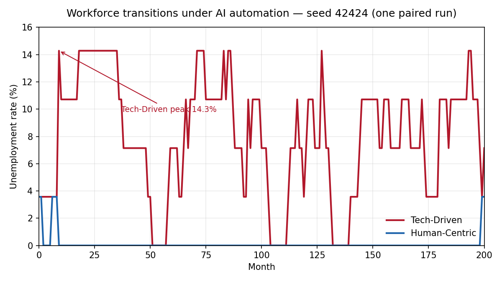

# Workforce Transitions Under AI Automation

## Policy impact at a glance

| Metric | Tech-Driven | Human-Centric |
| --- | --- | --- |
| Peak unemployment rate | 14.3% | 3.6% |
| Share of workers ever unemployed | 46.4% | 7.1% |
| Average unemployment spell among exposed workers | 34.4 months | 3.0 months |
| Unemployment burden Gini among exposed workers | 0.478 | 0.000 |
| Total output at horizon | 79.5 | 55.0 |

**Identical workers, identical workplace geography, identical random seed (42424) — only the policy regime changes.** Peak unemployment rate is the maximum over the 200-month horizon; the other four rows are end-of-horizon (month 200) values.

How the gap opens: concurrent training seats are hard-capped (5 in Tech-Driven versus 12 in Human-Centric), so at-risk workers queue for retraining, and those stuck in the queue too long fall into unemployment, where skill scarring makes re-entry progressively harder. Each worker's odds of entering training, completing it, and getting re-hired rise with adjacent coworkers who are in training or re-employed and are suppressed by unemployed ones, so recovery clusters and persistent-unemployment pockets emerge from local interactions rather than being scripted.

Why this matters now: policy frameworks for AI-driven labor disruption increasingly key staged responses to observed unemployment rates, and this paired run shows that the peak unemployment rate an automation shock produces is itself policy-dependent.

An agent-based NetLogo model of a small labor market adjusting to AI automation. The model compares two policy worlds, a Tech-Driven scenario with fast automation and thin retraining support, and a Human-Centric scenario with slower adoption and stronger worker support, holding everything else fixed. Both scenarios run on the same random seed, so every difference in outcomes is attributable to policy and technology parameters rather than chance.

Built for the Agentic Technologies course at Carnegie Mellon University. One tick is one month; the full horizon is 200 months of labor-market adjustment.

## Core finding

_Illustrative model output from a single paired run (seed 42424), regenerated from the committed data by [`extras/analyze_paired_comparison.py`](extras/analyze_paired_comparison.py)._

The core finding is an efficiency-equity tradeoff. Faster automation raises aggregate output but concentrates long unemployment spells on a subset of routine-task workers, and a capacity-constrained training system turns that exposure into persistent queues. Modest policy differences in training seats, course length, and subsidy support produce large aggregate differences because local peer spillovers amplify whichever regime is in place.

Full write-up with figures and limitations is in [the memo (PDF)](docs/ai-workforce-odyssey-memo.pdf).

## How the model works

Twenty-eight heterogeneous workers are the only agents. Each worker has a task type (routine-cognitive, routine-manual, creative-analytical, or hybrid), a routine share that governs automation exposure, an adaptability level, and an explicit household balance sheet with labor income, government transfers, consumption, and liquid assets.

Workers move across five labor-market states: employed, at-risk, in-training, unemployed, and re-employed. Displacement occurs when routine exposure under rising automation pressure crosses a disruption threshold. At-risk workers queue for a hard-capped number of training seats; those stuck in the queue too long fall into unemployment, where skill scarring makes recovery progressively harder.

The emergent mechanism is the interaction of the training bottleneck with local coworker spillovers. Workers sit on a fixed workplace grid, and orthogonal neighbors act as coworkers: visible training and re-employment among neighbors raises a worker's willingness to apply for training, while unemployed neighbors suppress it. Recovery clusters and persistent-unemployment pockets emerge from these local interactions; they are not programmed as outcomes.

The model also reports observer-level sector accounts each month: output, private investment, transfers, training outlays, capital stock, and a goods-market gap reported as an explicit diagnostic residual rather than a forced equilibrium identity.

## Reproduce

The committed benchmark data was generated with NetLogo 7.0.3; the model file itself is saved in NetLogo 6.4 format, which NetLogo 6.4 and later opens directly. Use 7.0.3 to reproduce the committed CSVs exactly.

To reproduce the headline table above:

1. Install [NetLogo](https://ccl.northwestern.edu/netlogo/) and open `model.nlogo`, launching from the repo root so exports land in `extras/data/`.
2. In the Command Center, run `benchmark-paired-comparison`. It fixes the random seed at 42424 and runs both scenarios on that same seed — Tech-Driven, then Human-Centric — over the full 200-month horizon; this is the controlled comparison behind the memo results.
3. Each run exports three CSVs (monthly history, plot series, and end-of-run worker panel) named by scenario and seed; the seed-42424 pair is what the table reports.
4. Cross-check with `python3 extras/analyze_paired_comparison.py` (requires pandas and matplotlib). It recomputes every number in the table from the committed CSVs, exits non-zero on any mismatch, and regenerates the figure — this step also works on its own, without NetLogo.

For interactive runs, pick a scenario with the `scenario-choice` chooser, then press `setup` and `go`. Additional Command Center benchmarks: `benchmark-tech-driven` and `benchmark-human-centric` run the canonical single-scenario benchmarks, and `benchmark-seed-panel` runs a small multi-seed robustness panel for both scenarios. The model file also embeds BehaviorSpace experiments (Tools → BehaviorSpace) for the single-scenario benchmarks and the seed-42424 paired comparison; the multi-seed robustness panel is run from the Command Center via `benchmark-seed-panel`.

## Repository contents

- `model.nlogo` — the full simulation, including interface, documentation tab, and BehaviorSpace experiments
- [`docs/ai-workforce-odyssey-memo.pdf`](docs/ai-workforce-odyssey-memo.pdf) — five-page memo with model design, scenario results, and limitations
- [`docs/ai-use-appendix.pdf`](docs/ai-use-appendix.pdf) — transparency appendix documenting how AI assistants were used during development, including verification practices
- `docs/figures/` — the headline figure above, generated from the committed data
- `extras/data/` — exported CSV runs, including the paired seed-42424 runs reported in the memo and additional robustness seeds
- [`extras/analyze_paired_comparison.py`](extras/analyze_paired_comparison.py) — recomputes the headline table from the committed CSVs (asserting it matches this README) and regenerates the figure

## Scope and limitations

This is a stylized course model, not a forecasting tool. Firms and government are scenario settings rather than strategic agents, a single training pathway is available, workers do not relocate, and the goods-market gap is an accounting diagnostic rather than a modeled equilibrium object. The theoretical framing draws on the task-based automation literature of Acemoglu and Restrepo; the model intentionally avoids claiming search-and-matching or general-equilibrium closure because those mechanisms are not implemented.

## References

- Acemoglu, D., and Restrepo, P. (2018). The Race between Man and Machine: Implications of Technology for Growth, Factor Shares, and Employment. American Economic Review, 108(6), 1488-1542.
- Acemoglu, D., and Restrepo, P. (2019). Automation and New Tasks: How Technology Displaces and Reinstates Labor. Journal of Economic Perspectives, 33(2), 3-30.

## License

MIT
